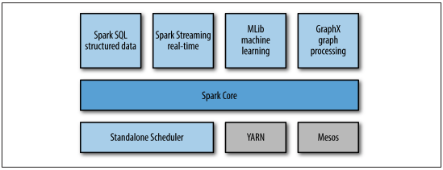
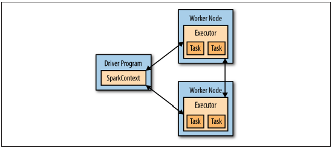

## CHAPTER1. Introduction to Date Analysis with Spark
### What Is Apache Spark?

- Spark Core
    - task scheduling
    - memory management
    - fault recovery
    - interacting with storage systems
    - RDD API
- Spark SQL
    - querying data
    - support Hive tables, Parquet, JSON
    - SQL interface
- Spark Streaming
    - live streams
    - manipulate data stored in memory, on disk, or arriving in real time
- MLlib
    - machine learning functionality
    - classification, regression, clustering, and collaborative filtering
    - lower-level ML primitives (gradient descent optimization algorithm)
- GraphX
    - manipulating graphs (social network's friend graph)
    - common graph algorithms (PageRank and triangle counting)
- Cluster Managers
    - Scale up from one to many thousands of compute nodes
    - Hadoop YARN, Apache Mesos, and a simple cluster manager (Standalone Scheduler)
    
### A Brief History of Spark
- Spark started in 2009, as a research project in the UC Berkeley RAD Lab

### Storage Layers for Spark
- support HDFS, S3, Cassandra, Hive, HBase
- Spark does not require Hadoop
- it simply has support for storage systems implementing the Hadoop APIs
- support text files, SequenceFiles, Avro, Parquet, and any other Hadoop InputFormat

## CHAPTER2. Downloading Spark and Getting Started
### Introduction to Core Spark Concepts
- every Spark app consists of driver program that launches various parallel operations on a cluster.
- Driver programs access Spark through a SparkContext
- To run these operations, driver programs typically manage a number of nodes called executors

### Standalone Applications
- Spark can be linked into standalone applications in either Java, Scala, or Python
- you need to initialize your own SparkContext. After that, the API is the same

### Initializing a SparkContext
- the minimal way to initialize a SparkContext
    - A cluster URL : Tells Spark how to connect to a cluster. `local` is that runs Spark on one thread on the local machine, without connecting to a cluster
    - An application name : This will identify your application on the cluster manager's UI
    