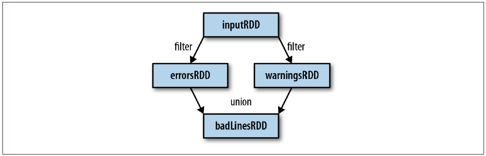
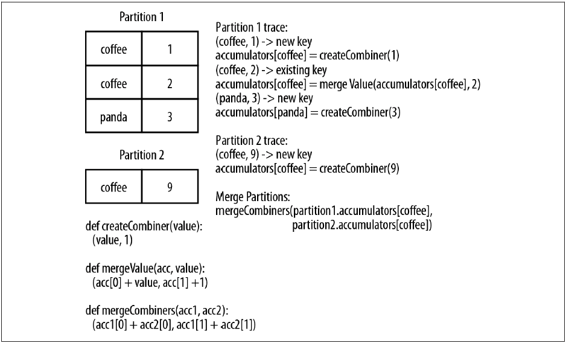

## CHAPTER1. Introduction to Date Analysis with Spark
### What Is Apache Spark?

- Spark Core
    - task scheduling
    - memory management
    - fault recovery
    - interacting with storage systems
    - RDD API
- Spark SQL
    - querying data
    - support Hive tables, Parquet, JSON
    - SQL interface
- Spark Streaming
    - live streams
    - manipulate data stored in memory, on disk, or arriving in real time
- MLlib
    - machine learning functionality
    - classification, regression, clustering, and collaborative filtering
    - lower-level ML primitives (gradient descent optimization algorithm)
- GraphX
    - manipulating graphs (social network's friend graph)
    - common graph algorithms (PageRank and triangle counting)
- Cluster Managers
    - Scale up from one to many thousands of compute nodes.
    - Hadoop YARN, Apache Mesos, and a simple cluster manager (Standalone Scheduler).
    
### A Brief History of Spark
- Spark started in 2009, as a research project in the UC Berkeley RAD Lab.

### Storage Layers for Spark
- support HDFS, S3, Cassandra, Hive, HBase.
- Spark does not require Hadoop.
- it simply has support for storage systems implementing the Hadoop APIs.
- support text files, SequenceFiles, Avro, Parquet, and any other Hadoop InputFormat.

## CHAPTER2. Downloading Spark and Getting Started
### Introduction to Core Spark Concepts
- every Spark app consists of driver program that launches various parallel operations on a cluster.
- Driver programs access Spark through a SparkContext.
- To run these operations, driver programs typically manage a number of nodes called executors.

### Standalone Applications
- Spark can be linked into standalone applications in either Java, Scala, or Python.
- you need to initialize your own SparkContext. After that, the API is the same.

### Initializing a SparkContext
- the minimal way to initialize a SparkContext.
    - A cluster URL : Tells Spark how to connect to a cluster. `local` is that runs Spark on one thread on the local machine, without connecting to a cluster.
    - An application name : This will identify your application on the cluster manager's UI.
    
## CHAPTER3. Programming with RDDs
- In Spark all work is expressed as either `creating new RDDs`, `transforming existing RDDs`, or `calling operations on RDDs` to compute a result

### RDD Basics
- RDD is an immutable distributed collection of objects.
- Each RDD is split into multiple partitions.
- RDDs offer two types of operations.
    - Transformations : construct a new RDD from a previous one.
    - Actions : compute a result based on an RDD.
- Spark's RDDs are by default recomputed each time you run an action on them.
- If you would like to reuse an RDD in multiple actions, you can ask Spark to persist it using `RDD.persist()`.

### Creating RDDs
- SparkContext's `parallelize()` method
- `SparkContext.textFile()`

### RDD Operations
#### Transformations
- transformed RDDs are computed lazily, only when you use them in an action.
- Spark keeps track of the set of dependencies between different RDDs called the lineage graph.

#### Actions
- They are the operations that return a final value to the driver program or write data to an external storage system.
- `collect()`function to retrieve the entire RDD.
- your entire dataset must fit in memory on a single machine to use `collect()`
- `collect()` shouldn't be used on large datasets.
- use `saveAsTextFile()` action, `saveAsSequenceFile()`

#### Lazy Evaluation
- it is best to think of each RDD as consisting of instructions on how to compute the data that we build up through transformations.
- when we call `sc.textFile()`, the data is not loaded until it necessary.

### Persistence
- In Scala and Java, the default persist() will store the data in the JVM heap as unserialized objects.
- In Python, we always serialize the data that persist stores.

- If you attempt to cache too much data to fit in memory, Spark will automatically evict old partitions using a Least Recently Used (LRU) cache policy.
- `unpersist()` lets you manually remove them from the cache.

## CHAPTER 4. Working with Key/Value Pairs
- This chapter covers how to work with RDDs of key/value pairs.
- ETL : extract, transform, and load

### Motivation
- Pair RDDs are a useful building block in many programs.
- Pair RDDs expose operations that allow you to act on each key in parallel or regroup data across the network.
- `reduceByKey()` can aggregate data separately for each key.
- `join()` can merge two RDDs together by grouping elements with the same key.

### Creating Pair RDDs
- In Python, `pairs = lines.map(lambda x: (x.split(" ")[0], x))`
- When creating, a pair RDD from an in-memory collection in Scala and Python, we only need to call `SparkContext.parallelize()` on a collection of pairs.

### Transformations on Pair RDDs
- `reduceByKey(func)`
- `groupByKey()`
- `mapValues(func)` is the same as `map{case (x, y): (x, func(y))}`

#### Aggregations
- These operations return RDDs and thus are transformations rather than actions.
- `reduceByKey(func)` run several parallel reduce operations, one for each key in the dataset, where each operation combines values that have the same key.
- `combineByKey()` is the most general of the per-key aggregation functions.
- Most of the other per-key combiners are implemented using `combineByKey()`.
- If it's a new element, `combineByKey()` uses a function we provide, called `createCombiner()`, to create the initial value for the accumulator on that key.
- This happens the first time a key is found in each partition.
- If it is a value we have seen before while processing that partition, it will instead use the provided function, `mergeValue()`
- When we are merging the results from each partition, if two or more partitions have an accumulator for the same key we merge the accumulators using the user-supplied `mergeCombiner()` function.

